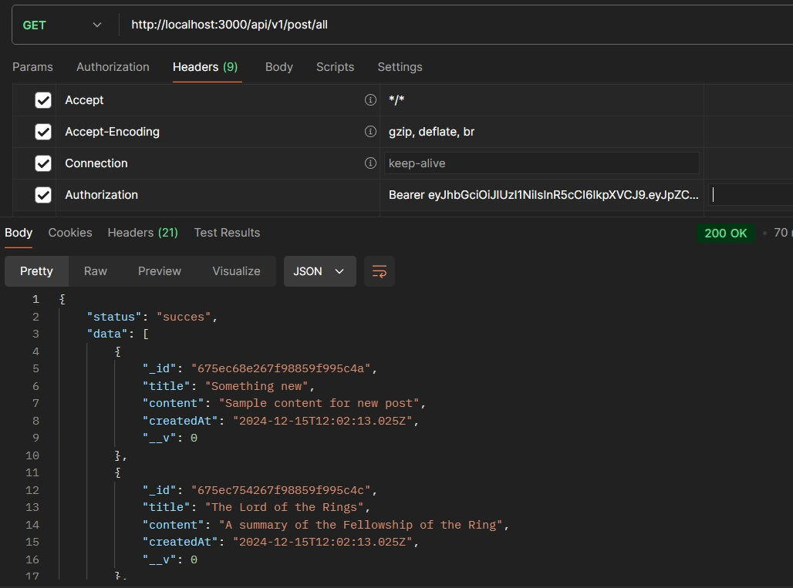

# NodeJS backEND API's and security

This is a server side logic used for creating different secure API endpoints, error handling and MongoDB database connections and operations. We used Postman API platform for testing the endpoints and displaying app information and errors. We also implemented some security features regarding common attacks such as XSS(cross-site scripting), DoS(denial of service), brute force attacks and NoSQL query injections.

## Run locally

Clone the project 

- git clone https://github.com/janbezovsek/Nodejs-MongoDB-Security-features-.git 

Go to the project directory and install required npm packages (package.json file)

Start the server (localhost:3000)

- open new terminal
- npm run server

We have to create an account for MongoDB database and setup our cluster. Then we aquire the connection string used for connecting the app to the database and save it in our .env file.

---

### .env file 

We have to change the DB_URL variable to match whatever value we have in our database configuration. Variables regarding JWT and cookies can also be changed to something else. NODE_ENV variable can be either development or production, the difference beeing the error response messages that we see as users.

#This can be either "development" or "production"

NODE_ENV = production

PORT = 3000

DB_URL = mongodb+srv://plenty:@cluster0.z3yuu.mongodb.net/?retryWrites=true&w=majority

#JWT related

JWT_SECRET = jnivshdjvlaskdmolmk

JWT_EXPIRES_IN = 1d

#Cookie related

COOKIE_EXPIRES_IN = 1

---

We build these API's where we can either create posts, delete them, update them or just showcase either all of them or just the selected ones. These posts are saved as documents in the database. Paralell to these functionalities we also created SignUp and Login endpoints for users to create an account and then login to gain access to before mentioned posts. Users are also saved in the database. Lastly, we defined error handling logic and tested all endpoints using Postman, where we defined a HTTP method (GET,POST...) and entered the required enpoint, for example http://localhost:3000/api/v1/post/all .
The security part of the code is located in the app.js file.

First, we have to sign up to create a user account, then we have to login to aquire JWT tokens which are neccessary for accessing all of the routes that we provided. We define JWT expiration time in our .env file.

Here we copy the token from login endpoint and use it for all of the routes except SignUp and Login

Passwords are hashed using Bcrypt package and are not returned to the users for security reasons. They are only stored on the database side.

We can see here we created Authorization header and inserted befor mentioned token under the name Bearer and then the value of the login token. This authorization header and its value is required for all post routes except SignUp and Login.

